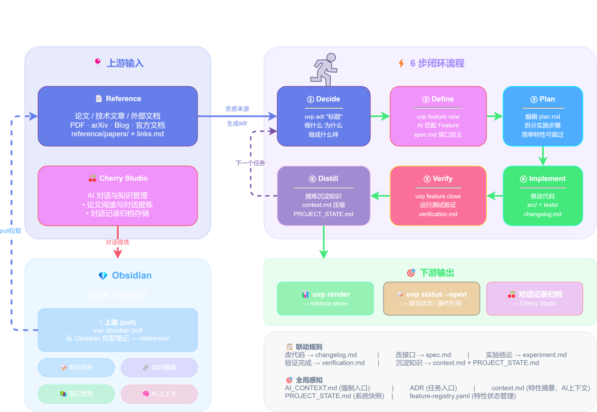

# uvp — Vibe Coding 工作流工具

> **Vibe Coding Is All You Need**

uvp 是一个与 AI 工作流耦合的项目管理工具。它把**特性**作为最小闭环单位，通过结构化文档、状态流转和文件联动规则，让 AI 能准确区分"当前事实"与"历史噪音"。

Rust 编译，单文件分发，不依赖运行时，支持 Windows / macOS / Linux。

## 项目框架



## 解决什么问题

1. **特性生命周期混乱** — AI 分不清当前事实和历史废案，上下文越来越脏
2. **多特性并行失控** — 靠人脑追踪每个特性的进度和依赖，很快就乱了
3. **变更无法溯源** — 对话框里的口头需求过几天就找不到了

## 核心设计

### 特性隔离

每个特性有独立目录和标准文件，互不干扰：

```
docs/features/FEAT-003-data-cleaning/
├── spec.md              # 做什么、怎么验收
├── changelog.md         # 改了什么、为什么改
├── verification.md      # 验证结果
├── context.md           # AI 压缩上下文
└── deliverables.md      # 产出记录（实验数据、模型指标等）
```

### 状态流转

```
idea → planned → in_progress → implemented → verified
                                    ↓
                                  paused
                                    ↓
                                deprecated → removed
```

每个状态转换都有进入/退出条件。要标记 `verified`，验收标准必须逐项通过。

### 6 步闭环工作流

```
Decide → Define → Plan → Implement → Verify → Distill
```

| 步骤 | 做什么 | 对应命令 |
|------|--------|---------|
| Decide | 架构决策，创建 ADR | `uvp adr "标题"` |
| Define | 创建/匹配 Feature，写 spec | `uvp feature new "标题"` |
| Plan | 复杂特性写 plan.md（可选） | — |
| Implement | 写代码 + 立即更新 changelog | — |
| Verify | 逐项检查验收标准，填 verification.md | `uvp feature close FEAT-NNN` |
| Distill | 提炼 context.md，更新全局状态 | — |

### 文件联动规则

| 动作 | 必须同步更新 |
|------|-------------|
| 改了 `src/` 代码 | 对应 Feature 的 `changelog.md` |
| 改了 API 接口 | 对应 Feature 的 `spec.md` |
| 做了实验 | `deliverables.md` |
| 完成验证 | `verification.md` |
| 关闭 Feature | `context.md` + `PROJECT_STATE.md` |

### 信息分层

| 层级 | 内容 | AI 是否默认读取 |
|------|------|----------------|
| 当前事实 | PROJECT_STATE、spec、context | 是 |
| 历史演进 | ADR、changelog、旧方案 | 否，追溯时读 |
| 验证证据 | verification、deliverables | 按需 |
| 参考资料 | 论文、外部文档 | 否 |

## 安装

```bash
# 下载对应平台的二进制文件，放入 PATH
# uvp.exe / uvp-macos-arm64 / uvp-linux-x64
```

## 快速开始

### 初始化项目

```bash
uvp init my-project
```

生成的目录结构：

```
my-project/
├── docs/
│   ├── adr/              # 架构决策记录
│   ├── features/         # 特性管理
│   ├── _meta/            # 元数据（feature-registry.yaml）
│   ├── AI_CONTEXT.md     # AI 规则入口
│   ├── PROJECT_STATE.md  # 当前状态快照
│   └── TODO.md           # 想法收集
├── src/
├── reference/            # 从 Obsidian 导入的素材
├── CLAUDE.md             # AI IDE 规则文件
├── uvp.toml              # 项目配置
└── mkdocs.yml            # 文档站配置
```

### 日常使用

```bash
uvp adr "选择 RandomForest 进行分类"        # Decide
uvp feature new "数据清洗模块" --adr 0001   # Define
uvp status                                # 查看状态
uvp feature close FEAT-003                # Verify + 关闭
uvp check                                 # 检查一致性
uvp render && mkdocs serve                # 渲染文档站
```

### 配置 AI IDE

```bash
uvp ide claude      # 生成 CLAUDE.md + 部署 Skills
uvp ide cursor      # 生成 .cursorrules + 部署 Skills
uvp ide trae        # 生成 .trae/rules.md + 部署 Skills
```

## 上下游协作

```
Obsidian（剪藏论文、博客、灵感）
    ↓
Cherry Studio（对话提炼技术要点）
    ↓
uvp obsidian pull（同步到项目 reference/）
    ↓
uvp adr "技术决策"（--from-obsidian 引用笔记）
    ↓
uvp + AI 6 步闭环协作
    ↓
uvp render → mkdocs build → 静态文档站
    ↓
uvp kanban → 全局看板（跨项目 TODO/Feature/ADR/Roadmap 聚合）
```

### 数据链路

```
TODO → ADR → Feature → Roadmap
```

- TODO 通过 `[ADR-NNN]` 标记关联决策
- ADR 通过 `related_features` 关联特性
- Feature 闭环后由 AI 语义匹配写入 Roadmap

## CLI 命令

| 命令 | 功能 |
|------|------|
| `uvp init` | 一键初始化项目结构 |
| `uvp adr` | 创建架构决策记录 |
| `uvp feature` | 特性生命周期管理 |
| `uvp obsidian` | Obsidian 笔记同步 |
| `uvp status` | 项目状态展示 |
| `uvp config` | 配置管理 |
| `uvp check` | 文档一致性检查 |
| `uvp render` | Mkdocs 页面渲染 |
| `uvp ide` | IDE 规则生成 + Skill 部署 |
| `uvp todo` | 想法/待办管理 |
| `uvp kanban` | 全局看板（本地 Web 服务器） |
| `uvp self update` | 检查并更新到最新版本 |

## AI Skills

uvp 内置 5 个 AI Skill，通过 `uvp ide` 部署到项目中，AI 每次对话自动加载：

| Skill | 功能 |
|-------|------|
| uvp-workflow | 6 步闭环工作流约束 |
| uvp-feature-lifecycle | Feature 模板和状态流转规范 |
| uvp-file-coupling | 文件修改联动规则 |
| uvp-meta-header | 文档 Meta Header 规范 |
| uvp-weekly-report | 周报自动生成 |

## 技术栈

- **语言**：Rust（Edition 2024），单文件二进制，模板通过 `include_str!` 编译时内嵌
- **Web 看板**：axum + tokio + rust-embed（后端）/ Svelte 5 + Vite + TailwindCSS 4（前端）
- **文档站**：MkDocs Material
- **平台**：Windows / macOS / Linux
